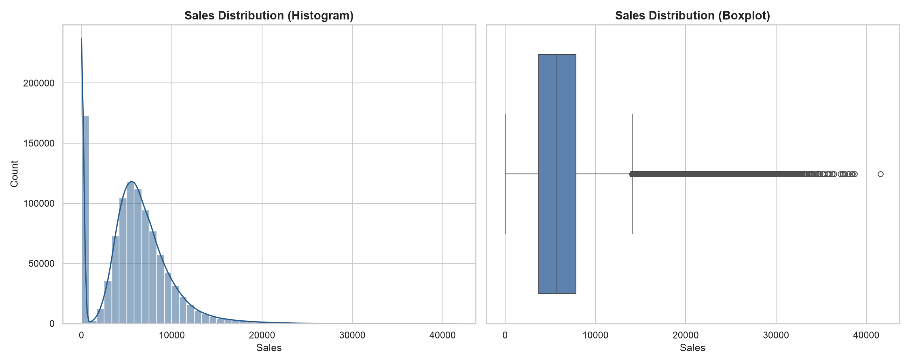

# Exploratory Data Analysis (EDA) Summary

This document summarizes the basic properties, structures, and outlier profiles of the primary training dataset (`train.csv`) compiled during the initial Exploratory Data Analysis phase.

---

## Analysis Results

### 1. Dataset Dimensions
* **Total Rows**: `1,017,209`
* **Total Columns**: `9`
* **Dataset Shape**: `(1,017,209, 9)`

### 2. Missing Values
* **Status**: No missing values found in any columns.
  
### 3. Duplicate Records
* **Status**: `0` duplicate rows detected. All transaction rows are unique.

### 4. Column Data Types
The columns conform to the following schema data types:

| Column | Pandas Data Type | Description / Interpretation |
| :--- | :--- | :--- |
| **Store** | `int64` | Store unique identifier |
| **DayOfWeek** | `int64` | Day of week index (1-7) |
| **Date** | `str` (object) | Date of transaction |
| **Sales** | `int64` | Store turnover (Target variable) |
| **Customers** | `int64` | Number of customers |
| **Open** | `int64` | Binary indicator (0 = closed, 1 = open) |
| **Promo** | `int64` | Binary indicator for promo activity |
| **StateHoliday** | `object` | Categorical indicator for state holidays |
| **SchoolHoliday** | `int64` | Binary indicator for school holidays |

---

## Outlier Analysis

Outliers are computed using the standard **Interquartile Range (IQR) method** where any data points falling outside $[Q1 - 1.5 \times IQR, Q3 + 1.5 \times IQR]$ are flagged as outliers (with a lower bound floor of 0).

### 1. Outliers in Sales
* **Lower Bound**: `0.0`
* **Upper Bound**: `14,049.5`
* **Outlier Count**: `26,694` rows (representing **2.62%** of the dataset)
* **Maximum Outlier Value**: `41,551`

### 2. Outliers in Customers
* **Lower Bound**: `0.0`
* **Upper Bound**: `1,485.0`
* **Outlier Count**: `38,095` rows (representing **3.75%** of the dataset)
* **Maximum Outlier Value**: `7,388`

---

## Target Variable Analysis: Sales

We analyzed the target variable `Sales` across the historical dataset to understand its statistical properties and distribution behavior.

### 1. Statistical Summary
* **Minimum**: `0`
* **Maximum**: `41,551`
* **Mean**: `5,773.82`
* **Median**: `5,744.00`
* **Standard Deviation**: `3,849.93`
* **Skewness**: `0.6415` (moderately right-skewed)
* **Kurtosis**: `1.7784`

### 2. Visualizations
The distribution of `Sales` is visualized below with a histogram (showing overall frequency distribution and KDE curve) and a boxplot (highlighting the median, IQR bounds, and outlier instances above `14,049.5`):

---
