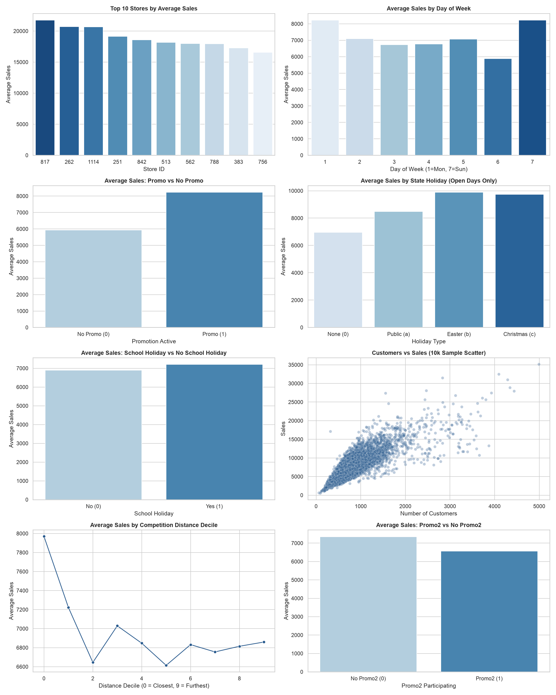
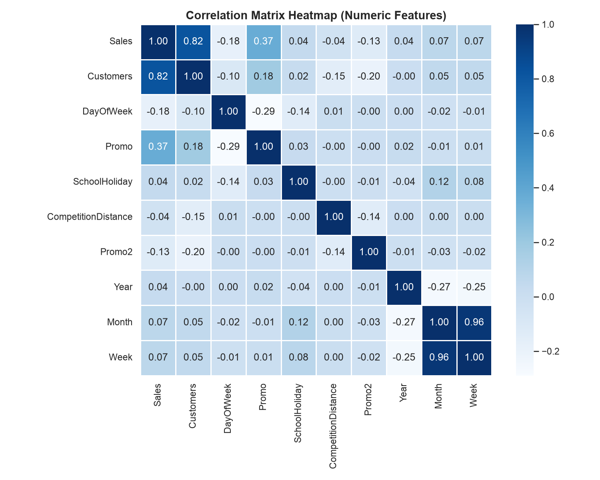
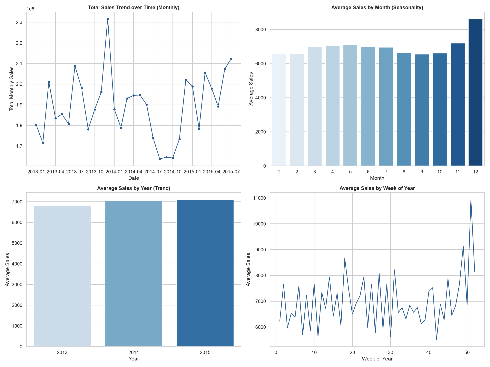

# Exploratory Data Analysis (EDA) Summary

This document summarizes the basic properties, structures, and outlier profiles of the primary training dataset (`train.csv`) compiled during the initial Exploratory Data Analysis phase.

---

## Analysis Results

### 1. Dataset Dimensions
* **Total Rows**: `1,017,209`
* **Total Columns**: `9`
* **Dataset Shape**: `(1,017,209, 9)`

### 2. Missing Values
* **Status**: No missing values found in any columns.
  
### 3. Duplicate Records
* **Status**: `0` duplicate rows detected. All transaction rows are unique.

### 4. Column Data Types
The columns conform to the following schema data types:

| Column | Pandas Data Type | Description / Interpretation |
| :--- | :--- | :--- |
| **Store** | `int64` | Store unique identifier |
| **DayOfWeek** | `int64` | Day of week index (1-7) |
| **Date** | `str` (object) | Date of transaction |
| **Sales** | `int64` | Store turnover (Target variable) |
| **Customers** | `int64` | Number of customers |
| **Open** | `int64` | Binary indicator (0 = closed, 1 = open) |
| **Promo** | `int64` | Binary indicator for promo activity |
| **StateHoliday** | `object` | Categorical indicator for state holidays |
| **SchoolHoliday** | `int64` | Binary indicator for school holidays |

---

## Outlier Analysis

Outliers are computed using the standard **Interquartile Range (IQR) method** where any data points falling outside $[Q1 - 1.5 \times IQR, Q3 + 1.5 \times IQR]$ are flagged as outliers (with a lower bound floor of 0).

### 1. Outliers in Sales
* **Lower Bound**: `0.0`
* **Upper Bound**: `14,049.5`
* **Outlier Count**: `26,694` rows (representing **2.62%** of the dataset)
* **Maximum Outlier Value**: `41,551`

### 2. Outliers in Customers
* **Lower Bound**: `0.0`
* **Upper Bound**: `1,485.0`
* **Outlier Count**: `38,095` rows (representing **3.75%** of the dataset)
* **Maximum Outlier Value**: `7,388`

---

## Target Variable Analysis: Sales

We analyzed the target variable `Sales` across the historical dataset to understand its statistical properties and distribution behavior.

### 1. Statistical Summary
* **Minimum**: `0`
* **Maximum**: `41,551`
* **Mean**: `5,773.82`
* **Median**: `5,744.00`
* **Standard Deviation**: `3,849.93`
* **Skewness**: `0.6415` (moderately right-skewed)
* **Kurtosis**: `1.7784`

### 2. Visualizations
The distribution of `Sales` is visualized below with a histogram (showing overall frequency distribution and KDE curve) and a boxplot (highlighting the median, IQR bounds, and outlier instances above `14,049.5`):

---

## Feature Relationships Analysis

We evaluated the impact of individual store profiles, operational schedules, promotional strategies, holidays, and competitor parameters on daily store sales.

### 1. Key Findings
* **Top Performing Stores**: Stores `817`, `262`, `1114`, `251`, and `842` achieve the highest average turnovers, with daily averages exceeding **18,500** (compared to the overall active store average of **6,955.96**).
* **Weekly Patterns**: Mondays are the strongest standard weekdays (averaging **8,216.25**). Sundays are closed **97.5%** of the time, but the few open stores (3,593 observations out of 144,730 total Sunday logs) generate high average sales of **8,224.72**.
* **Short-Term Promotions (`Promo`)**: Active campaigns yield a massive sales lift of **38.77%** (averaging **8,228.74** with promos vs **5,929.83** without).
* **State Holidays**: While holidays lead to widespread closures, stores that remain open on Easter and Christmas experience a sales spike to **9,887.90** and **9,743.75** respectively.
* **School Holidays**: Slightly boost daily average sales by **+4.4%** (**7,200.71** vs **6,897.21**), representing higher family shopping traffic.
* **Competition Distance**: Near-zero correlation (**-0.0365**) with sales. However, decile grouping shows stores with competitors in the closest decile actually experience higher average sales, suggesting prime retail real estate is mutually shared.
* **Continuous Promotions (`Promo2`)**: Surprisingly, stores enrolled in Promo2 generate **10.8% lower sales** on average (**6,558.99** vs **7,350.82** without Promo2), implying promotional fatigue or selection bias (Promo2 implemented in historically weaker stores).

### 2. Feature Relationship Visualizations
The relationships between these categorical and numeric features with daily Sales are grouped below:

---

## Correlation Analysis

A Pearson correlation analysis was conducted to establish linear relationships among features and identify collinearity risks.

### 1. Analysis Insights
* **Primary Predictor**: `Customers` is the single strongest driver of sales, with a correlation of **0.8236**.
* **Promo Impact**: `Promo` exhibits a moderate positive correlation of **0.3682**.
* **Multicollinearity Flag**: `Month` and `Week` (week of year) are extremely correlated at **0.97**. During preprocessing or modeling, one of these features should be dropped or combined to avoid training instability.

### 2. Correlation Matrix Heatmap
The heatmap below shows the correlation values for all numeric features:

---

## Time Analysis

Sales trends were evaluated over multiple granularities (yearly, monthly, and weekly) to identify growth trajectories and seasonal effects.

### 1. Analysis Insights
* **Seasonality**: Highly pronounced seasonal patterns are present. Sales surge dramatically in **December** (daily active average of **8,608.96** due to holiday shopping) and crash to their annual low in **January** (**6,564.30**).
* **Upward Trend**: Year-over-year performance is growing. Daily active average sales rose from **6,814.78 in 2013** to **7,026.13 in 2014**, and reached **7,088.24 in 2015**.

### 2. Time Trend Visualizations
The charts below show the monthly, yearly, and weekly aggregates and averages:

---

## Actionable Business Insights

Based on this comprehensive analysis, the following operational actions are recommended for store managers and supply chain planners:

1. ⚡ **Optimize Promo Logistics**: Short-term promotions drive a **38.77% sales lift**. Inventory level forecasts and shelf stocking schedules should be dynamically scaled up on promo days to prevent stockouts.
2. 👥 **Footfall is Key**: Because customer count is highly correlated with sales ($r = 0.82$), customer retention and store conversion strategies directly drive revenue.
3. 🎄 **December Inventory Readiness**: Average daily sales jump by **24.5% in December** compared to the rest of the year. Procurement schedules must anticipate this spike to secure supply chains.
4. 🛑 **Re-evaluate Continuous Promos (`Promo2`)**: Long-term promotions show a **10.8% drop** in average active sales. This suggests continuous promotions dilute urgency. We recommend phasing out Promo2 in favor of high-impact, short-term promotions.
5. 🏬 **Sunday Openings**: While most stores close on Sunday, the ones that remain open generate extremely high average daily sales. If local zoning/labor regulations permit, expanding Sunday openings for specific high-density stores represents a significant growth opportunity.
