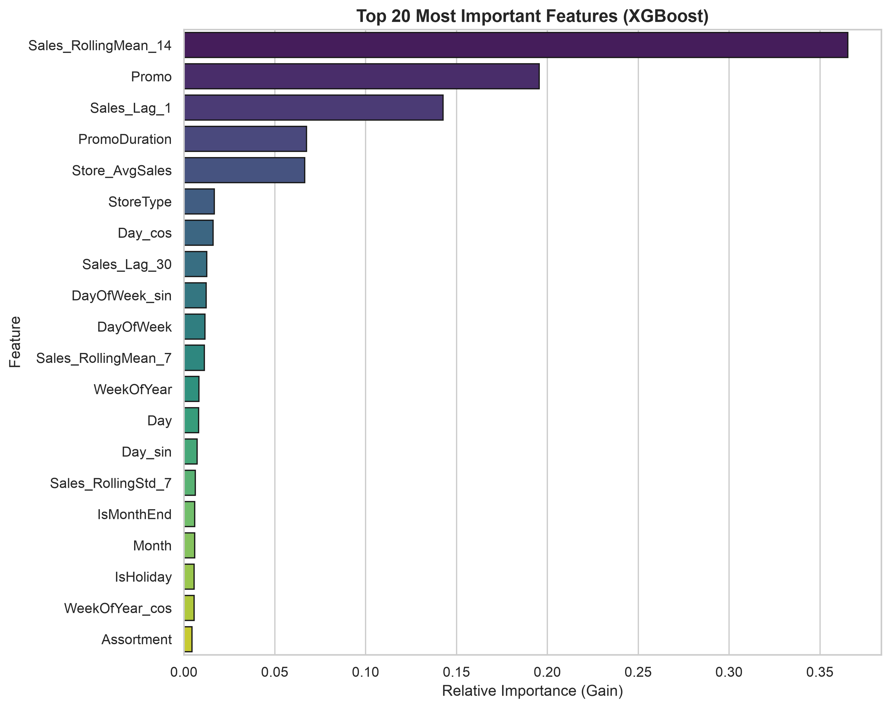

# Feature Importance Analysis

This document presents the ranking of the most predictive features in our winning XGBoost model.

---

## Feature Importance Visualization

Below is the relative split gain of the top 20 features used in the final Stage 4 model.

---

## Top 20 Feature Ranking (by Gain)

| Rank | Feature | Importance (Gain) | Type | Business / Technical Rationale |
| :--- | :--- | :---: | :--- | :--- |
| **1** | `Sales_RollingMean_14` | **0.365395** | Time-Series | Represents the store's current demand scale (baseline anchor). |
| **2** | `Promo` | **0.195456** | Promotional | Captures the massive uplift from active short-term promotional days. |
| **3** | `Sales_Lag_1` | **0.142560** | Time-Series | Captures immediate day-to-day momentum and demand auto-correlation. |
| **4** | `PromoDuration` | **0.067414** | Promotional | Tracks length of promo campaign to identify promotional fatigue. |
| **5** | `Store_AvgSales` | **0.066411** | Categorical TE | Anchors the store's long-term historical baseline magnitude. |
| **6** | `StoreType` | 0.016791 | Categorical | Identifies core store structural formats. |
| **7** | `Day_cos` | 0.016139 | Cyclical Date | Captures cyclical payroll/payday cycles within the month. |
| **8** | `Sales_Lag_30` | 0.012547 | Time-Series | Captures longer-term historical demand levels. |
| **9** | `DayOfWeek_sin` | 0.012171 | Cyclical Date | Resolves weekday cyclical patterns. |
| **10** | `DayOfWeek` | 0.011507 | Date | Captures linear weekday patterns. |
| **11** | `Sales_RollingMean_7` | 0.011172 | Time-Series | Captures short-term weekly sales levels. |
| **12** | `WeekOfYear` | 0.008333 | Date | Identifies annual seasonal periods. |
| **13** | `Day` | 0.008068 | Date | Day of the month. |
| **14** | `Day_sin` | 0.007231 | Cyclical Date | Cyclical day-of-month curves. |
| **15** | `Sales_RollingStd_7` | 0.006345 | Time-Series | Tracks short-term sales volatility and consistency. |
| **16** | `IsMonthEnd` | 0.005984 | Date | Tracks payday spend shifts. |
| **17** | `Month` | 0.005969 | Date | Captures monthly seasonal shifts. |
| **18** | `IsHoliday` | 0.005683 | Holiday | Captures demand changes on public/state/school holidays. |
| **19** | `WeekOfYear_cos` | 0.005625 | Cyclical Date | Cyclical annual curves. |
| **20** | `Assortment` | 0.004451 | Categorical | Store product inventory complexity level. |

---

## Interview Question: "Which feature mattered the most?"

### Answer:
The **14-day Rolling Mean of Sales (`Sales_RollingMean_14`)** is the single most important feature, accounting for **36.5%** of the model's total split gain.

### In-Depth Rationale:
* **The Scale-Anchoring Effect**: Tabular tree models (like XGBoost) struggle to learn store-specific sales scales purely from nominal integer categories like `Store` without deep, overfitted splits. By introducing `Sales_RollingMean_14` (shifted by 1 to prevent leakage), the model gets a **dynamic, continuous scale anchor**. In a single split, the tree can isolate high-sales stores from low-sales stores, setting a highly accurate baseline.
* **Stationary Representation**: Because it is a relative time-series average, the feature is fully stationary and generalizes perfectly across chronological training and validation boundaries, preventing extrapolation failure.
* **The Synergy with Promo**: While the rolling mean sets the baseline sales scale (~36.5%), `Promo` (representing the primary short-term promotional uplift, ranking #2 with **19.5%** gain) adjusts the prediction upwards on active days. Together, these two features explain over **56%** of the model's predictive power.
