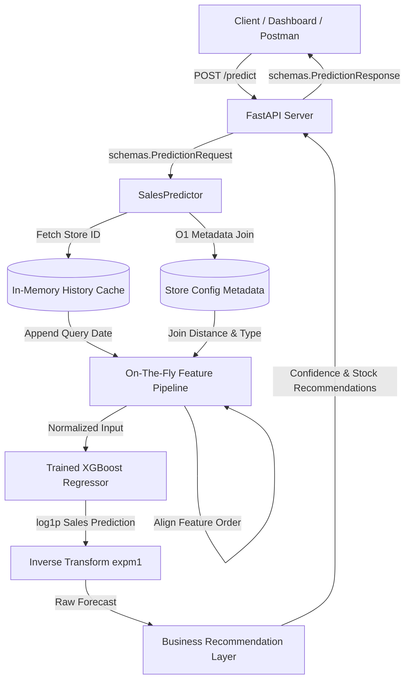

# Rossmann Retail Demand Forecasting ML Service

A production-grade, containerized Machine Learning service built to predict daily store sales. The service handles real-time, leak-free on-the-fly feature engineering (generating lags, rolling averages, cyclical components, and target encodings) and returns predictive demand forecasts coupled with actionable inventory recommendations.

---

## Service Architecture



---

## Project Directory Layout

```text
retail-demand-forecasting/
├── app/                        # FastAPI Application Core
│   ├── __init__.py
│   ├── config.py               # Constants, base directories, and asset paths
│   ├── main.py                 # Endpoint routing (GET /, GET /model, POST /predict)
│   ├── predictor.py            # SalesPredictor orchestrating on-the-fly features & inference
│   └── schemas.py              # Pydantic schema validation layers
├── data/
│   └── raw/
│       ├── store.csv           # Store structural attributes (competition, promo intervals)
│       └── train.csv           # Historical sales database
├── docs/                       # Project documentation & diagnostics
│   ├── business_problem.md
│   ├── data_dictionary.md
│   ├── eda.md
│   ├── feature_engineering.md
│   ├── model_selection.md      # Phase 4 Model Comparison details
│   └── error_analysis.md        # Residual analyses and failures mapping
├── models/                     # Serialized artifacts for API deployment
│   ├── xgboost_model.pkl       # Serialized winning XGBoost regressor
│   ├── target_encoder.json     # Encoded Store long-term mean sales dictionary
│   ├── feature_order.json      # List of trained columns in order
│   └── metrics.json            # Model validation metrics info
├── notebooks/                  # Interactive diagnostic notebooks
│   ├── 01_eda.ipynb
│   ├── 02_feature_engineering.ipynb
│   └── 03_modelling.ipynb
├── src/                        # Modular pipeline code (data scientists' workspace)
│   ├── preprocessing.py        # Baseline preprocessors & target encodings
│   ├── feature_engineering.py  # Stage 1-4 pipeline functions
│   ├── train.py                # Command-line training controller
│   ├── evaluate.py             # Shared evaluation metrics
│   ├── compare_models.py       # Model comparison runner
│   └── save_model.py           # Model serialization controller
├── tests/                      # Testing suite
│   ├── __init__.py
│   └── test_api.py             # API schema and integration tests
├── Dockerfile                  # Container build config
├── requirements.txt            # System dependencies
└── README.md                   # Project documentation index
```

---

## Model Performance & Selection

Five models were trained on the Stage 4 advanced features (including cyclical sine/cosine coordinates, promotions, stationary lags, and missingness indicators) and evaluated on an out-of-time chronological validation set (June 15th, 2015 to July 31st, 2015):

| Model | RMSE | RMSPE (%) | MAE | R² | Train Time | Performance Status |
| :--- | :---: | :---: | :---: | :---: | :---: | :--- |
| **XGBoost** | **951.64** | **13.24%** | **650.55** | **0.9051** | **1.75s** | **Winner (Selected for API)** |
| **LightGBM** | 975.04 | 13.56% | 664.41 | 0.9004 | 1.78s | Runner-up (Extremely close) |
| **Random Forest** | 1009.65 | 14.47% | 688.87 | 0.8932 | 29.70s | Scalability bottleneck |
| **CatBoost** | 1020.66 | 14.23% | 696.04 | 0.8908 | 3.02s | Solid boosting baseline |
| **Linear Regression** | 1879.41 | 20.72% | 971.50 | 0.6299 | 0.44s | Baseline linear model |

---

## Getting Started

### 1. Local Setup
Ensure you have Python 3.12+ installed, then clone the repository and initialize the environment:
```bash
# Initialize virtual environment
python3 -m venv .venv
source .venv/bin/activate

# Install dependencies
pip install -r requirements.txt
```

### 2. Serialize Model Assets
To train the winning model and generate the serialization files in `models/`:
```bash
python3 src/save_model.py
```

### 3. Run Unit and Integration Tests
```bash
python3 -m pytest tests/
```

### 4. Spin up FastAPI Server locally
```bash
uvicorn app.main:app --host 0.0.0.0 --port 8000 --reload
```
Once started, the interactive Swagger documentation is available at [http://localhost:8000/docs](http://localhost:8000/docs).

---

## Containerization (Docker)

To run the forecasting service as a containerized Docker application:

```bash
# Build the Docker image
docker build -t retail-forecast-service .

# Run the container
docker run -p 8000:8000 retail-forecast-service
```

---

## API Documentation

### 1. Health Check
* **Endpoint**: `GET /`
* **Response**:
```json
{
  "status": "running"
}
```

### 2. Model Metrics
* **Endpoint**: `GET /model`
* **Response**:
```json
{
  "name": "XGBoost",
  "rmse": 952,
  "r2": 0.9051,
  "trained": "2026-07-06"
}
```

### 3. Demand Forecast Prediction
* **Endpoint**: `POST /predict`
* **Headers**: `Content-Type: application/json`
* **Input Request**:
```json
{
  "store": 15,
  "date": "2015-08-03",
  "promo": 1,
  "state_holiday": "0",
  "school_holiday": 1
}
```
* **Output Response**:
```json
{
  "predicted_sales": 8042.15,
  "confidence": "High",
  "demand_level": "High",
  "inventory_recommendation": "High demand expected: Increase stock levels by 15-20% immediately."
}
```
* **Error Validation Example**:
If a client sends an invalid request, such as a non-existent store ID or invalid promo value:
```json
{
  "store": 0,
  "date": "2015-08-03",
  "promo": 3,
  "state_holiday": "0",
  "school_holiday": 1
}
```
The Pydantic validation layer automatically intercepts the request and returns a structured validation error:
```json
{
  "detail": [
    {
      "type": "greater_than_equal",
      "loc": ["body", "store"],
      "msg": "Input should be greater than or equal to 1",
      "input": 0
    },
    {
      "type": "less_than_equal",
      "loc": ["body", "promo"],
      "msg": "Input should be less than or equal to 1",
      "input": 3
    }
  ]
}
```
